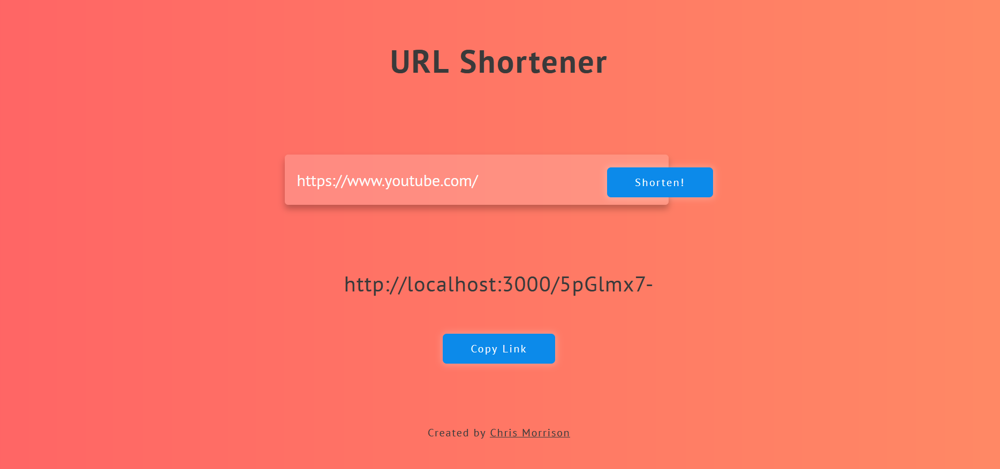
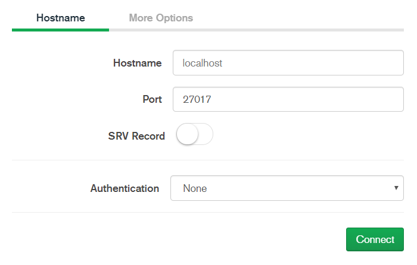

# URL Shortener using NodeJS & MongoDB, and a lightweight HTML/CSS front-end




This application shortens the url entered by the user. It stores the URL in the database, and when identical URLS are entered, it returns the same URL to avoid duplicates.

MongoDB is a non-relational database that is very fast, and easy to use.

**Note**: This project is set up to run on your local environment, and would need to be configured to be made usable by the public. 

---

## Setup and Use

Step 1: Clone the repo

```bash
git clone https://github.com/chrisnmorrison/shorten-url-js-mongo
```

Step 2: cd into the cloned repo and run:

```bash
npm install
```

Step 3: Install & Run MongoDB

If you aren't entirely familiar with MongoDB, i'd recommend using [Compass](https://www.mongodb.com/products/compass) as a desktop GUI until you learn Mongo on the CLI. See Mongo Docs to learn how to set up a local environment.

Step 4: If you are using Compass

Under the New Connections tab, click on:

```
Fill in connection fields individually
```

Then, enter the following details



Step 4: Install Nodemon (optional but recommended)

```bash
npm install -g nodemon
```

Step 5: Start the application

```bash
npm start
```

## Author

- [**Chris Morrison**](https://chrismorrison.ca)

## To-do List

- [X] Make more coffee ☕
- [ ] Make Front-End look a bit cleaner
- [ ] Remove formatting styles in body tag to allow other content to be added to page (i.e. rework 100vh to something more flexible)
- [ ] Make Mobile-friendly
- [ ] Make copy button appear only when link is present 
- [ ] Add (at the very least) an About page
- [ ] Deploy to a web server


<!-- ## Contribute

You can fork this repo and send me a PR.

## License

This project is licensed under the MIT License. -->
